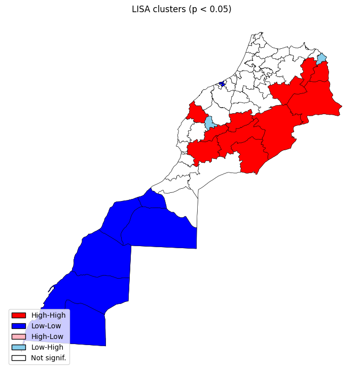

# Analyse Spatiale de la Pauvreté au Maroc

## 📋 Vue d'ensemble

Analyse économétrique spatiale de la pauvreté au niveau provincial au Maroc, examinant l'impact de l'analphabétisme et de l'activité économique en tenant compte des **interdépendances spatiales** entre provinces.

## 📊 Données

- **61 provinces marocaines**
- **Variables** : Taux de pauvreté (PAUVR), Taux d'analphabétisme (ANALPH), Taux d'activité (ACTIV)
- **Matrice spatiale** : Contiguïté Queen

## 🔍 Résultats Clés

### Autocorrélation Spatiale

**I de Moran = 0.522*** (p = 0.001)** : Forte autocorrélation spatiale positive - les provinces voisines présentent des niveaux de pauvreté similaires.

**Analyse LISA** : Identification de clusters spatiaux significatifs (p < 0.05)
- **Clusters High-High** (rouge) : Centre et est - concentration de pauvreté élevée
- **Clusters Low-Low** (bleu) : Sud saharien - faible pauvreté

### Modèles Spatiaux

#### Modèle SAR
**ρ = 0.427*** (p < 0.001)** : Effet de diffusion spatiale - le niveau de pauvreté d'une province est positivement influencé par celui de ses voisines.

#### Modèle SEM
**λ = 0.622*** (p < 0.001)** : Autocorrélation spatiale des erreurs - les chocs non observés affectant une province impactent aussi ses voisines.

### Décomposition des Effets (LeSage & Pace, 2009)

| Variable | Effet Direct | Effet Indirect | Effet Total | Amplification |
|----------|-------------|----------------|-------------|---------------|
| **ANALPH** | 0.3792*** | 0.1748*** | 0.5540*** | +46% |
| **ACTIV** | -0.5997*** | -0.2550*** | -0.8547*** | +42% |

**Interprétations** :
- **Analphabétisme** : +1 point → +0.38 points de pauvreté locale + **0.17 points de spillover** sur les voisins
- **Activité économique** : +1 point → -0.60 points de pauvreté locale + **-0.26 points de spillover** sur les voisins

Les effets indirects représentent **30-32% de l'impact total**, révélant d'importantes externalités spatiales.

## 💡 Implications Politiques

1. **Effets multiplicateurs** : Investir dans une province génère 30-32% d'effets supplémentaires sur les provinces voisines

2. **Sous-estimation** : Ignorer les interdépendances spatiales sous-estime l'impact réel des politiques de **42-46%**

3. **Coordination territoriale** : Nécessité d'une approche régionale coordonnée plutôt que province par province

4. **Ciblage stratégique** : Les interventions dans les provinces centrales peuvent servir de leviers pour maximiser l'impact territorial

## 🛠️ Technologies

Python : `geopandas`, `pysal`, `spreg`, `matplotlib`

---

**Contexte** : Master ESEF - Université de Lorraine | Ministère de l'Économie et des Finances  
**Date** : Février 2026
